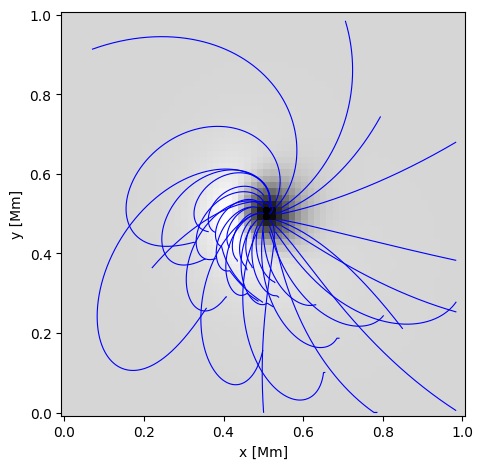
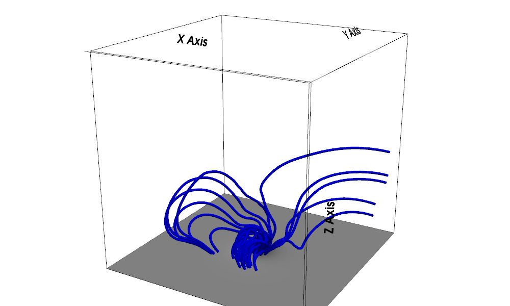

## 概要

太陽磁場の推定は擾乱に起因する宇宙天気変動の予測につながるため、電波障害や有人飛行に被害を及ぼす放射線の予測に繋がる.<br>
しかし太陽磁場の全体を観測によって得ることは不可能なので、機械学習などの手法で境界条件を入力として与え外挿する必要がある.<br>
これは教師データなしでPINN(Phisics Informed Neural Network)の物理式のみを用いて磁場を推定するプログラム.<br>
物理的な一貫性を保ちつつ容量の大きな教師データ不要で学習可能な点が強みである.<br>

## サンプリングポイント

ランダムなサンプリングポイントを生成しそこで物理式が満たされるように学習を行う


## 物理式と損失関数

```math
\begin{aligned}
L_{bc}
&=
\frac{1}{N_z}
\sum
\left\langle
\left| b(x,y,0)-B(x,y,0) \right|^2
\right\rangle \\
\\
L_{div}
&=
\sum
\left\langle
(\nabla \cdot b)^2
\right\rangle \\
\\
L_{j\times b}
&=
\sum
\left\langle
\left| (\nabla \times b)\times b \right|^2
\right\rangle \\
\\
Loss
&=
\omega_{bc}L_{bc}
+
\omega_{div}L_{div}
+
\omega_{j\times b}L_{j\times b}
\end{aligned}
```

これらの式を0に近づけるように学習.<br>

## 実行例

境界条件として使用する磁場データ. これを入力として与える.<br>


ニューラルネットワークを上記の物理式に基づいて最適化.<br>
その後推論を行い全体の磁場を導出する.<br>
