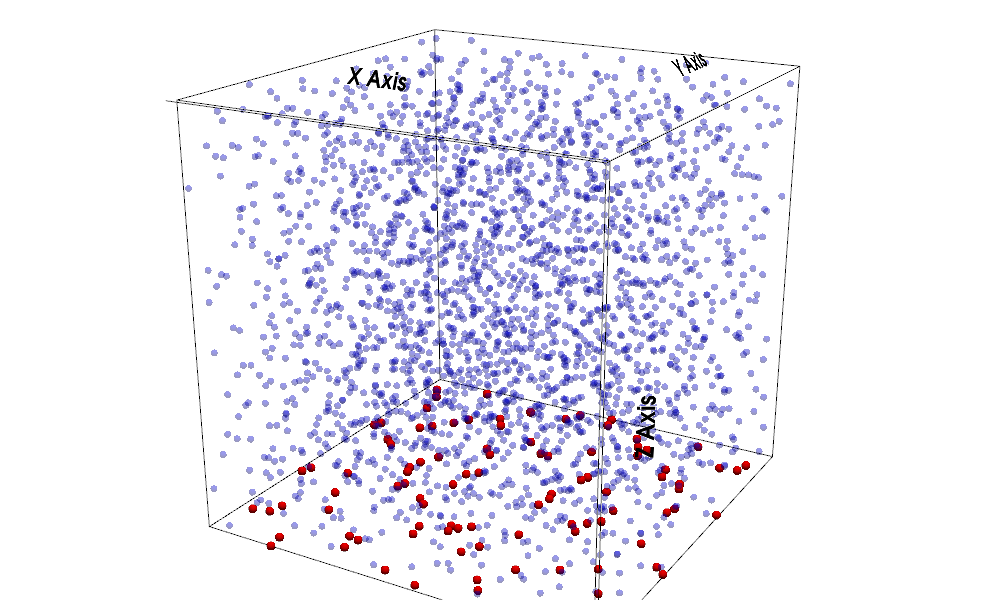

教師データなしでPINNの物理式のみを用いて磁場を推定するプログラム
## サンプリングポイント

ランダムなサンプリングポイントを生成しそこで物理式が満たされるように学習を行う



## Physical Constraints

```math
\begin{aligned}
L_{bc}
&=
\frac{1}{N_z}
\sum
\left\langle
\left| b(x,y,0)-B(x,y,0) \right|^2
\right\rangle \\
\\
L_{div}
&=
\sum
\left\langle
(\nabla \cdot b)^2
\right\rangle \\
\\
L_{j\times b}
&=
\sum
\left\langle
\left| (\nabla \times b)\times b \right|^2
\right\rangle \\
\\
Loss
&=
\omega_{bc}L_{bc}
+
\omega_{div}L_{div}
+
\omega_{j\times b}L_{j\times b}
\end{aligned}
```